

  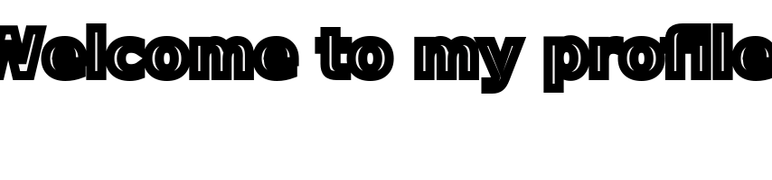

  <h1>
    
  </h1>

  

  

  

| Logo | Project | Tech Stack | Description |
|------|---------|------------|-------------|
| | **🎨 Frontend** | | |
| 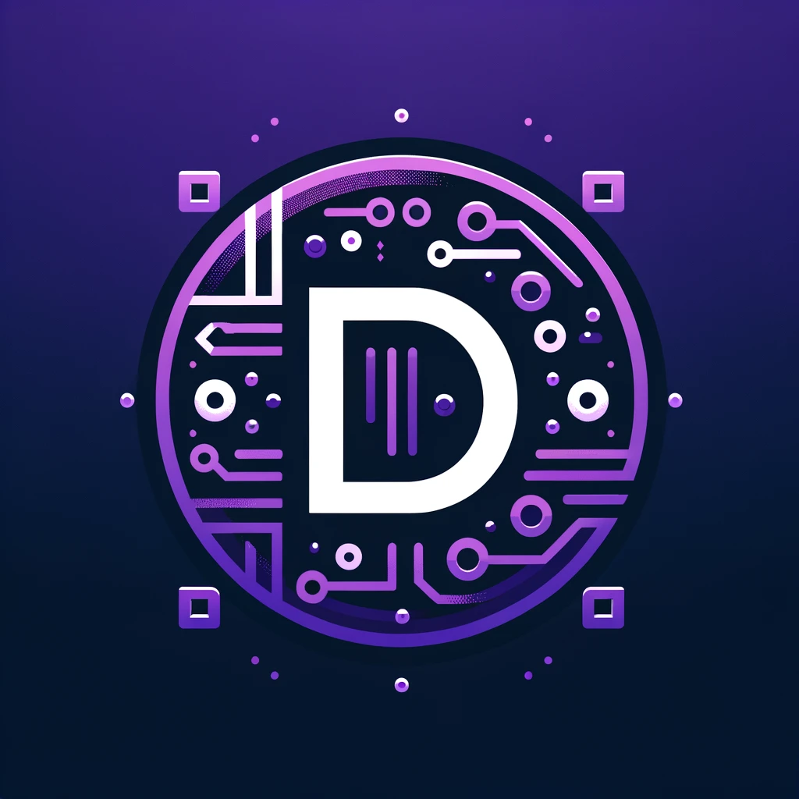 | [dawidolko.pl](https://github.com/dawidolko/dawidolko.pl) |    | Personal portfolio website |
|  | [WorkStation](https://github.com/dawidolko/WorkStation-Vue-TypeScript) |   | Professional workstation management interface |
|  | [FitnessGym](https://github.com/dawidolko/FitnessGym-Project-React) |  | Fitness gym website with class schedules and memberships |
|  | [Layout-Simple-Vue](https://github.com/dawidolko/Layout-Simple-Vue) |  | Minimalist layout template with Vue.js |
|  | [Rent-App-Vue](https://github.com/dawidolko/Rent-App-Vue) |  | Rental property browsing application |
|  | [Kebab-Project](https://github.com/dawidolko/Kebab-Project-React) |  | Restaurant menu and ordering interface |
| 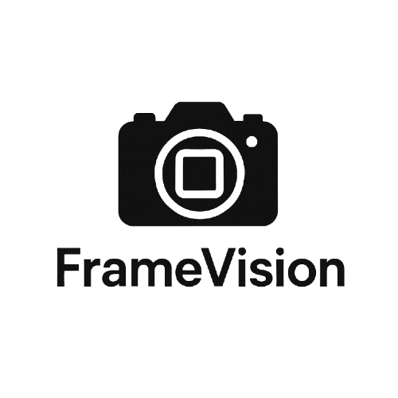 | [FrameVision](https://github.com/dawidolko/FrameVision-Project-HTML-CSS-JS-SASS) |     | Responsive image gallery and visualization platform |
| 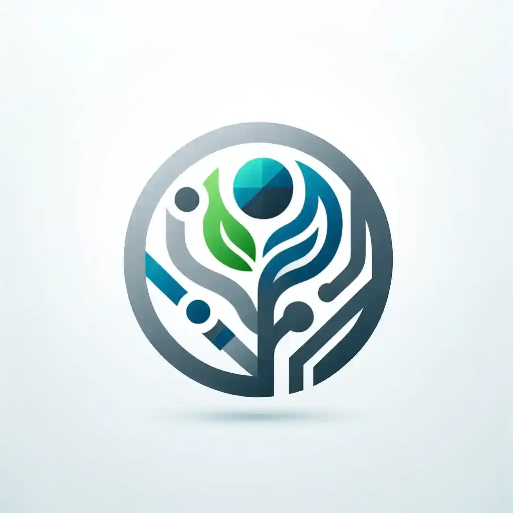 | [WidgetMart](https://github.com/dawidolko/WidgetMart-Project-HTML-CSS-JS) |    | Interactive widget marketplace interface |
|  | [CuriositiesMagazine](https://github.com/dawidolko/CuriositiesMagazine-Project-HTML-CSS) |   | Magazine-style content presentation website |
|  | [F1Zone](https://github.com/dawidolko/F1Zone-Project-HTML-CSS-JS-SASS) |     | Formula 1 fan website with race information and statistics |
| | **🚀 Fullstack** | | |
|  | [SmartRecommender](https://github.com/dawidolko/SmartRecommender-Project-Django-React) |   | E-commerce recommendation system with collaborative filtering and sentiment analysis |
|  | [TechByte](https://github.com/dawidolko/TechByte-Project-Laravel) |  | Technology news and blog platform |
| 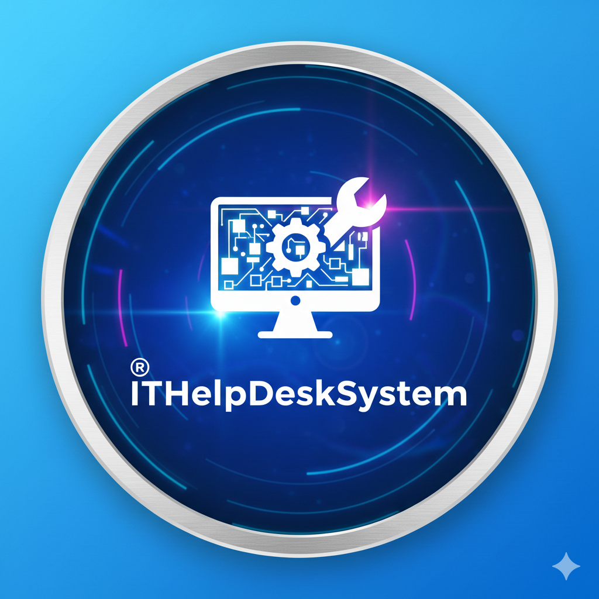 | [ITHelpDeskSystem](https://github.com/dawidolko/ITHelpDeskSystem-Project-ASPNetCore-Vue) |   | IT helpdesk ticketing and support management system |
| 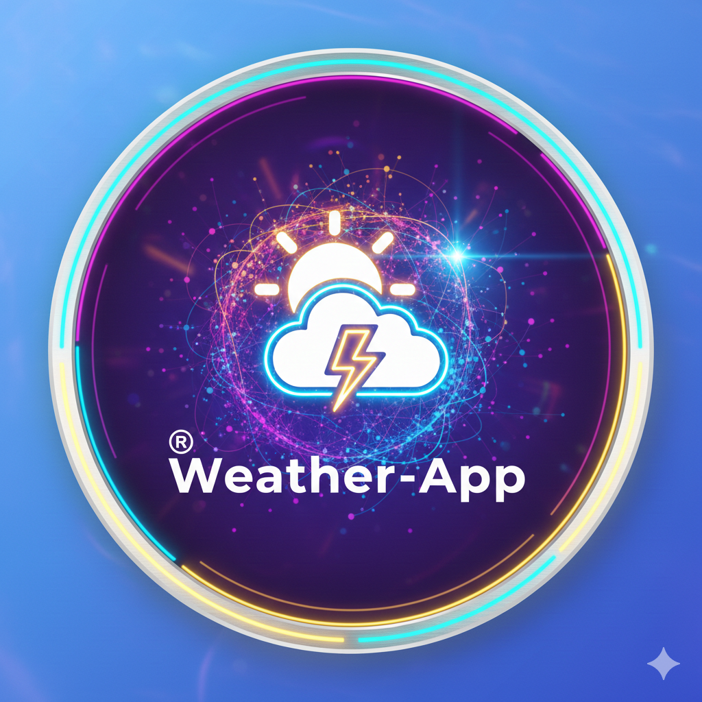 | [Weather-App](https://github.com/dawidolko/Weather-App-Laravel-React) |   | Weather forecast application with API integration |
|  | [LanguageCourses](https://github.com/dawidolko/LanguageCourses-Project-Laravel) |   | Language learning course management platform |
| 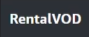 | [RentalVOD](https://github.com/dawidolko/RentalVOD-Project-Laravel) |  | Video-on-demand rental service platform |
|  | [Shop-App](https://github.com/dawidolko/Shop-App-Laravel-Vue) |   | Full-featured e-commerce platform with SPA architecture |
|  | [Shop-Vue-Firestore](https://github.com/dawidolko/Shop-Vue-Firestore-Demo) |   | E-commerce demo application with real-time database |
| 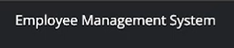 | [Employees-List](https://github.com/dawidolko/Employees-List-Project-Laravel) |   | Employee management system with CRUD operations |
| | **💻 Desktop** | | |
| 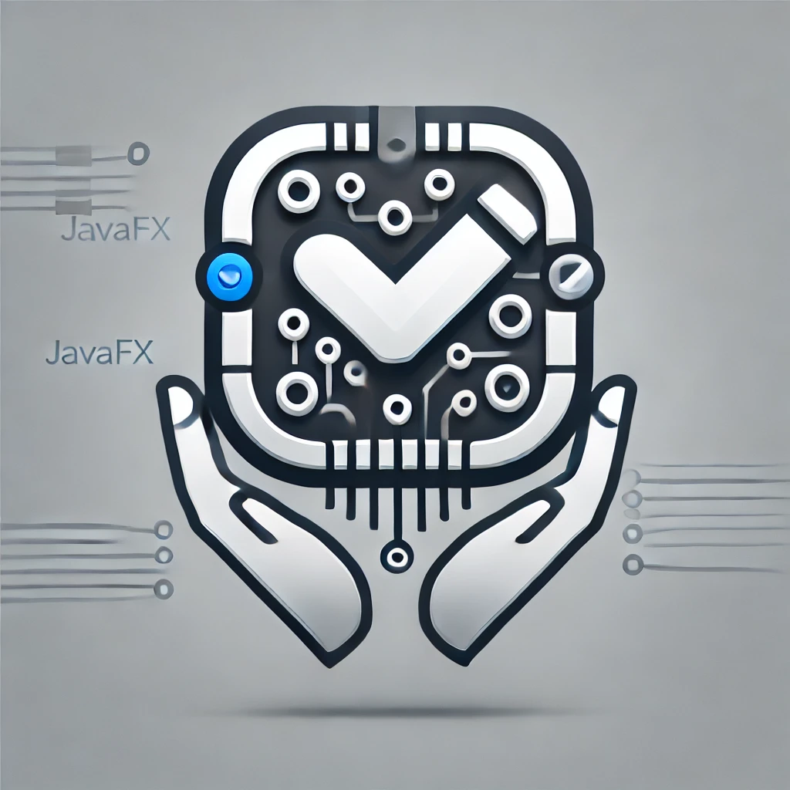 | [TaskApp](https://github.com/dawidolko/TaskApp-JavaFX) |  | Desktop task management application with GUI |
|  | [ATM-System](https://github.com/dawidolko/ATM-System-Java-Swing) |  | ATM banking simulation system |
| | **📱 Mobile** | | |
|  | [WiFiDirectFileTransfer](https://github.com/dawidolko/WiFiDirectFileTransfer-Kotlin) |   | File transfer application using WiFi Direct technology |
| | **🤖 AI & ML** | | |
|  | [Comparison-ANFIS-Classical-ML](https://github.com/dawidolko/Comparison-ANFIS-Classical-Machine-Learning-Models-Python) |   | Comparative analysis of ANFIS and classical machine learning models |
| 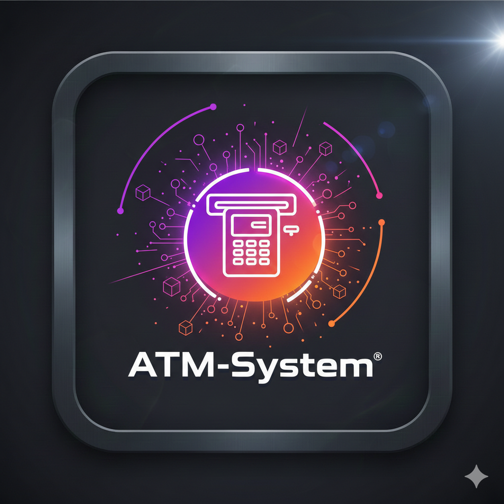 | [DataFusion-App](https://github.com/dawidolko/DataFusion-App-Python) |  | Application for data fusion and computational analysis |

<!-- 

I am a computer science student with a passion for technology, programming, and artificial intelligence. 🧠

I am always hungry for new knowledge and strive to explore the latest trends and tools that help me create innovative solutions. 💻

My passion for artificial intelligence goes beyond my studies - I aim to understand its various aspects and how it can be applied to solve real-world problems.

I believe that the future of technology lies in the hands of AI, and I am excited to be a part of that future.

On my GitHub, you will find various projects related to programming and artificial intelligence that showcase my growth and learning in these areas.

With each project, I aim to learn something new and enhance my skills.

Feel free to explore my projects and reach out to me if you have any questions or would like to discuss potential collaboration opportunities.

Thank you for visiting my profile. I'm glad you're here! 🎉

 -->

  <a href="https://www.youtube.com/watch?v=mxBYGaA2oOU&t=2s">
    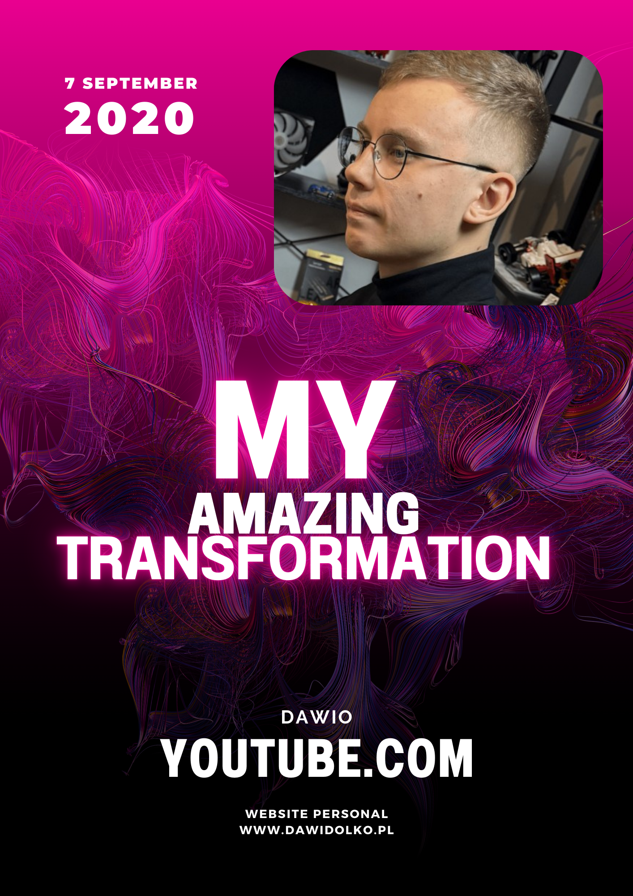
    
    
  </a>

## **My profile stats here:**

<!-- 

  

 -->

  
  

  

  

## **Skills & Technologies:**

<!-- 

  Visitors : 
  

 -->

  

    
  

  

    
  

  

    
  

  

    
  

  

  

## **Connect with me:**

  

  

    
  

    
    

  

  

    
    
    
    
    
  

  

  

  

  

 
