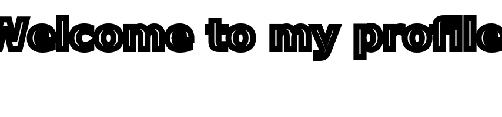
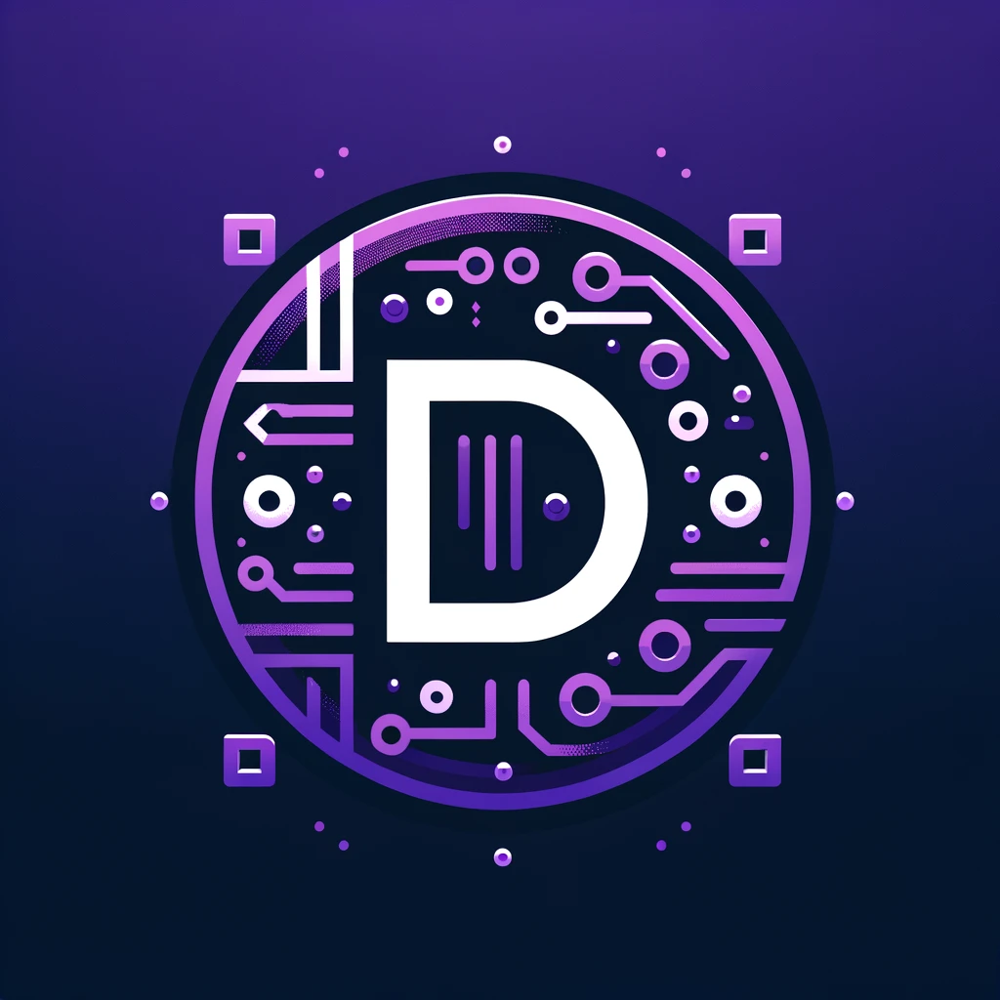
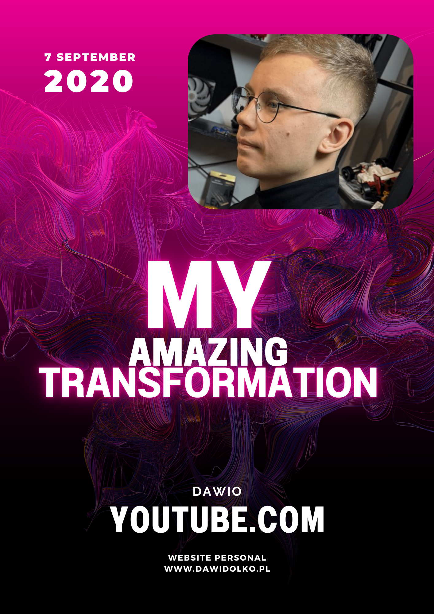

  

  

  

    
      
  

   

  

---

## 🚀 Featured Projects

|                                                            Logo                                                            | Project                                                                                                                 | Tech Stack                                                                                                                                                                                                                                                                                                                                                                           | Description                                                                                                                                                                                                                                                   |                                                                                                         ⭐ Stars                                                                                                         |
| :------------------------------------------------------------------------------------------------------------------------: | ----------------------------------------------------------------------------------------------------------------------- | ------------------------------------------------------------------------------------------------------------------------------------------------------------------------------------------------------------------------------------------------------------------------------------------------------------------------------------------------------------------------------------ | ------------------------------------------------------------------------------------------------------------------------------------------------------------------------------------------------------------------------------------------------------------- | :----------------------------------------------------------------------------------------------------------------------------------------------------------------------------------------------------------------------: |
|                                                                                                                            | **🎨 Frontend**                                                                                                         |                                                                                                                                                                                                                                                                                                                                                                                      |                                                                                                                                                                                                                                                               |                                                                                                                                                                                                                          |
|                              | [Portfolio](https://github.com/dawidolko/portfolio)                                                                     |                                                                                                                                                                                   | New personal portfolio website (2025-2026)                                                                                                                                                                                                                    |                                                                                                  |
|                                      | [dawidolko.pl](https://github.com/dawidolko/dawidolko.pl)                                                               |                                                                                            | Old personal portfolio website (2023-2024)                                                                                                                                                                                                                    |                                                                                            |
|                           | [WorkStation](https://github.com/dawidolko/WorkStation-Vue-TypeScript)                                                  |                                                                                                                                                                                | Professional workstation management interface                                                                                                                                                                                                                 |                                                                |
|                            | [FitnessGym](https://github.com/dawidolko/FitnessGym-Project-React)                                                     |                                                                                                                                                                                                                                                                                            | Fitness gym website with class schedules and memberships                                                                                                                                                                                                      |                                                                    |
|                          | [Layout-Simple-Vue](https://github.com/dawidolko/Layout-Simple-Vue)                                                     |                                                                                                                                                                                                                                                                                         | Minimalist layout template with Vue.js                                                                                                                                                                                                                        |                                                                                  |
|                                  | [Rent-App-Vue](https://github.com/dawidolko/Rent-App-Vue)                                                               |                                                                                                                                                                                                                                                                                         | Rental property browsing application                                                                                                                                                                                                                          |                                                                                            |
|                                 | [Kebab-Project](https://github.com/dawidolko/Kebab-Project-React)                                                       |                                                                                                                                                                                                                                                                                            | Restaurant menu and ordering interface                                                                                                                                                                                                                        |                                                                              |
|                            | [FrameVision](https://github.com/dawidolko/FrameVision-Project-HTML-CSS-JS-SASS)                                        |     | Responsive image gallery and visualization platform                                                                                                                                                                                                           |                                            |
|                              | [WidgetMart](https://github.com/dawidolko/WidgetMart-Project-HTML-CSS-JS)                                               |                                                                                            | Interactive widget marketplace interface                                                                                                                                                                                                                      |                                                        |
|                              | [CuriositiesMagazine](https://github.com/dawidolko/CuriositiesMagazine-Project-HTML-CSS)                                |                                                                                                                                                                                                     | Magazine-style content presentation website                                                                                                                                                                                                                   |                                            |
|                                     | [F1Zone](https://github.com/dawidolko/F1Zone-Project-HTML-CSS-JS-SASS)                                                  |     | Formula 1 fan website with race information and statistics                                                                                                                                                                                                    |                                                      |
|                         | [DevTechBlog](https://github.com/dawidolko/DevTechBlog-Platform-React)                                                  |                                                                                                                                                                                                                                                                                            | Developer tech blog platform for sharing articles and tutorials                                                                                                                                                                                               |                                                                |
|                             | [BitRecruit-Platform-NextJS](https://github.com/dawidolko/BitRecruit-Platform-NextJS)                                   |                                                                                                                                                                                            | BitRecruit recruitment platform built with Next.js                                                                                                                                                                                                            |                                                                |
|                                                                                                                            | **🚀 Fullstack**                                                                                                        |                                                                                                                                                                                                                                                                                                                                                                                      |                                                                                                                                                                                                                                                               |                                                                                                                                                                                                                          |
|                                | [SmartRecommender](https://github.com/dawidolko/SmartRecommender-Project-Django-React)                                  |                                                                                                                                                                                               | E-commerce recommendation system with collaborative filtering and sentiment analysis                                                                                                                                                                          |                                          |
|                            | [TechByte](https://github.com/dawidolko/TechByte-Project-Laravel)                                                       |                                                                                                                                                                                               | Technology news and blog platform                                                                                                                                                                                                                             |                                                                    |
|                                 | [ITHelpDeskSystem](https://github.com/dawidolko/ITHelpDeskSystem-Project-ASPNetCore-Vue)                                |                                                                                                                                                                                                  | IT helpdesk ticketing and support management system                                                                                                                                                                                                           |                                      |
|                  | [Weather-App](https://github.com/dawidolko/Weather-App-Laravel-React)                                                   |                                                                                                                                                                                            | Weather forecast application with API integration                                                                                                                                                                                                             |                                                                  |
|                                 | [LanguageCourses](https://github.com/dawidolko/LanguageCourses-Project-Laravel)                                         |                                                                                                                                                                                            | Language learning course management platform                                                                                                                                                                                                                  |                                                      |
|                            | [RentalVOD](https://github.com/dawidolko/RentalVOD-Project-Laravel)                                                     |                                                                                                                                                                                            | Video-on-demand rental service platform                                                                                                                                                                                                                       |                                                                  |
|                  | [Shop-App](https://github.com/dawidolko/Shop-App-Laravel-Vue)                                                           |                                                                                                                                                                                         | Full-featured e-commerce platform with SPA architecture                                                                                                                                                                                                       |                                                                            |
|                  | [Shop-Vue-Firestore](https://github.com/dawidolko/Shop-Vue-Firestore-Demo)                                              |                                                                                                                                                                                      | E-commerce demo application with real-time database                                                                                                                                                                                                           |                                                                      |
|                  | [Employees-List](https://github.com/dawidolko/Employees-List-Project-Laravel)                                           |                                                                                                                                                                                            | Employee management system with CRUD operations                                                                                                                                                                                                               |                                                        |
|                                | [CinemaReserve](https://github.com/dawidolko/CinemaReserve-Project-Node-Angular)                                        |                                                                                                                                                                                      | Cinema seat reservation system with booking management                                                                                                                                                                                                        |                                                |
|                                | [MovieVault](https://github.com/dawidolko/MovieVault-Project-SpringBoot-React)                                          |                                                                                                                                                                                   | Movie management and vault application                                                                                                                                                                                                                        |                                              |
|                                   | [MP-Industries](https://mp-industries.pl/)                                                                              |                                                                                                                                                                                            | Multibranch enterprise platform for CNC, LPG, dog breeding and honey products                                                                                                                                                                                 |                                                                                                                                      |
|                                                                                                                            | **💻 Desktop**                                                                                                          |                                                                                                                                                                                                                                                                                                                                                                                      |                                                                                                                                                                                                                                                               |                                                                                                                                                                                                                          |
|                 | [TaskApp](https://github.com/dawidolko/TaskApp-JavaFX)                                                                  |                                                                                                                                                                                                                                                                                               | Desktop task management application with GUI                                                                                                                                                                                                                  |                                                                                        |
|                                | [ATM-System](https://github.com/dawidolko/ATM-System-Java-Swing)                                                        |                                                                                                                                                                                                                                                                                               | ATM banking simulation system                                                                                                                                                                                                                                 |                                                                          |
|                                                                                                                            | **📱 Mobile**                                                                                                           |                                                                                                                                                                                                                                                                                                                                                                                      |                                                                                                                                                                                                                                                               |                                                                                                                                                                                                                          |
|    | [WiFiDirectFileTransfer](https://github.com/dawidolko/WiFiDirectFileTransfer-Kotlin)                                    |                                                                                                                                                                                         | File transfer application using WiFi Direct technology                                                                                                                                                                                                        |                                                          |
|                                                                                                                            | **🤖 AI & ML**                                                                                                          |                                                                                                                                                                                                                                                                                                                                                                                      |                                                                                                                                                                                                                                                               |                                                                                                                                                                                                                          |
|                                 | [Comparison-ANFIS-Classical-ML](https://github.com/dawidolko/Comparison-ANFIS-Classical-Machine-Learning-Models-Python) |                                                                                                                                                                         | Comparative analysis of ANFIS and classical machine learning models                                                                                                                                                                                           |  |
|                                                                           | [DataFusion-App](https://github.com/dawidolko/DataFusion-App-Python)                                                    |                                                                                                                                                                         | Application for data fusion and computational analysis                                                                                                                                                                                                        |                                                                          |
|  | [CyberAttack-Classifier-Python](https://github.com/dawidolko/CyberAttack-Classifier-Python)                             |                                                                                                                                                                         | Python multiclass classifier for DDoS / Malware / Intrusion on Kaggle data (Random Forest, Gradient Boosting).                                                                                                                                                                                                                                                                                                                                             |                                                          |
<!-- |                                                                                                                          | **👺 CMS**                                                                                                              |                                                                                                                                                                                                                                                                                                                                                                                      |                                                                                                                                                                                                                                                               |                                                                                                                                                                                                                          |
|                         | [dawkit-cms](https://github.com/dawidolko/dawkit)                                                                       |                                                                                                                                                                                            | My own CMS                                                                                                                                                                                                                                                    |                                                                                                        |
-->

<!-- 

I am a computer science student with a passion for technology, programming, and artificial intelligence. 🧠

I am always hungry for new knowledge and strive to explore the latest trends and tools that help me create innovative solutions. 💻

My passion for artificial intelligence goes beyond my studies - I aim to understand its various aspects and how it can be applied to solve real-world problems.

I believe that the future of technology lies in the hands of AI, and I am excited to be a part of that future.

On my GitHub, you will find various projects related to programming and artificial intelligence that showcase my growth and learning in these areas.

With each project, I aim to learn something new and enhance my skills.

Feel free to explore my projects and reach out to me if you have any questions or would like to discuss potential collaboration opportunities.

Thank you for visiting my profile. I'm glad you're here! 🎉

 -->

  

---

## 📊 Profile Stats

<!-- 

  

 -->

  

  

  

---

## 🛠️ Skills & Technologies

<!-- 

  Visitors : 
  

 -->

  

    
  

  

    
  

  

    
  

  

  

  

    
  

---

## 🤝 Connect with me

  

  

<!-- 

    
  

 -->

<!-- 

    
    

 -->

  

  

    
    
    
    
    
  

  

  

  

