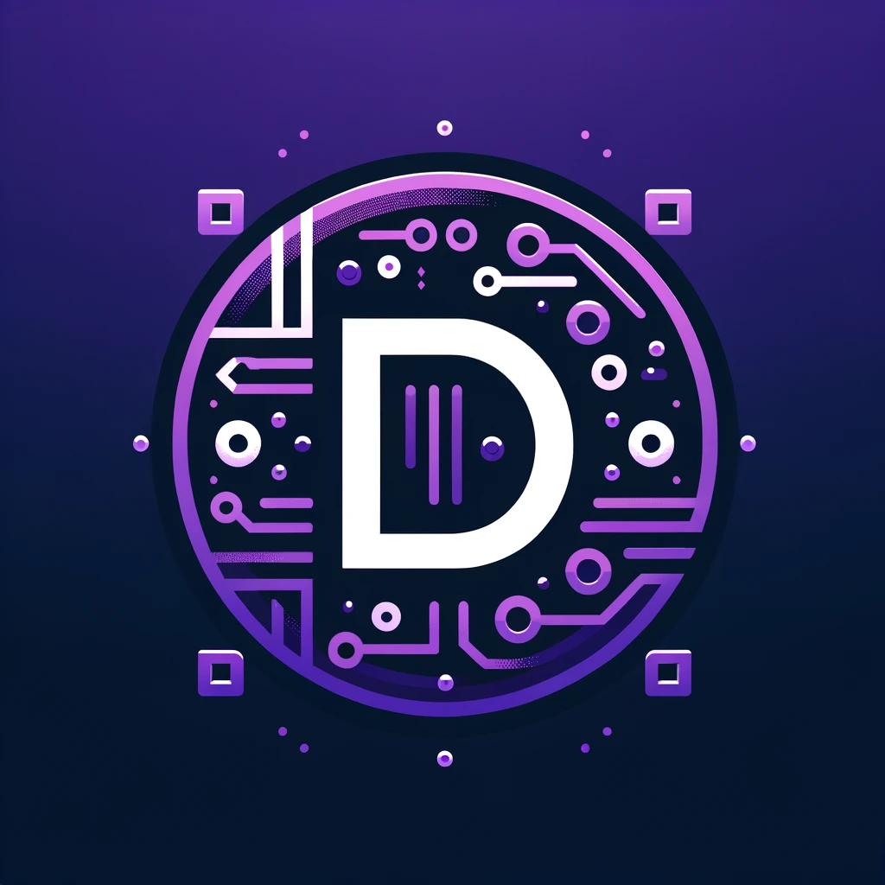
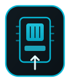
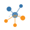
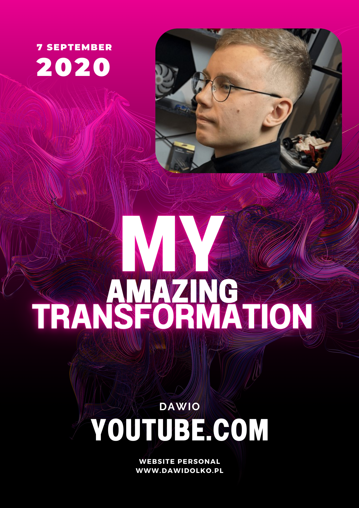
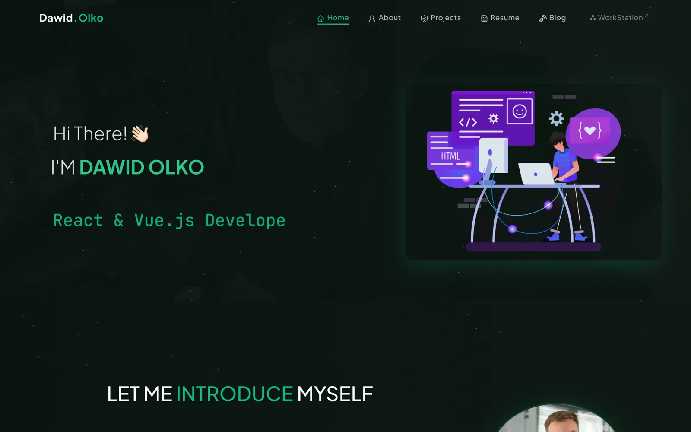
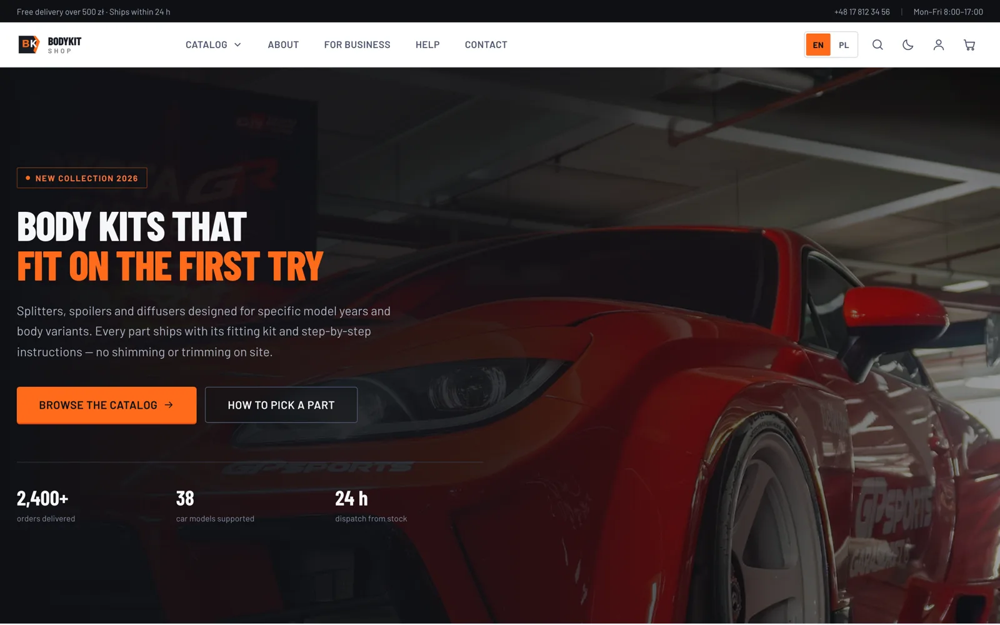
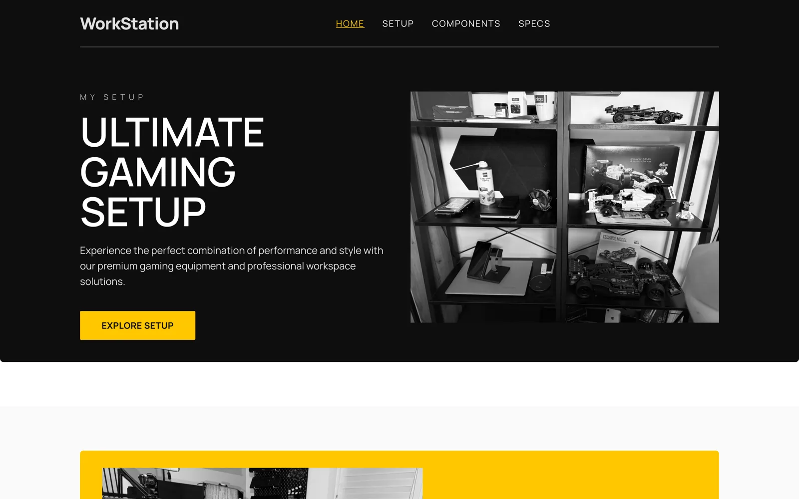
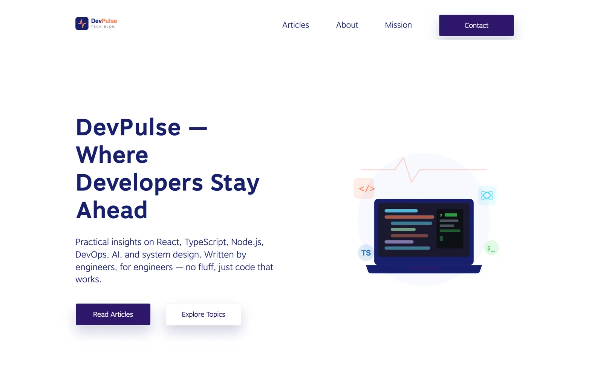
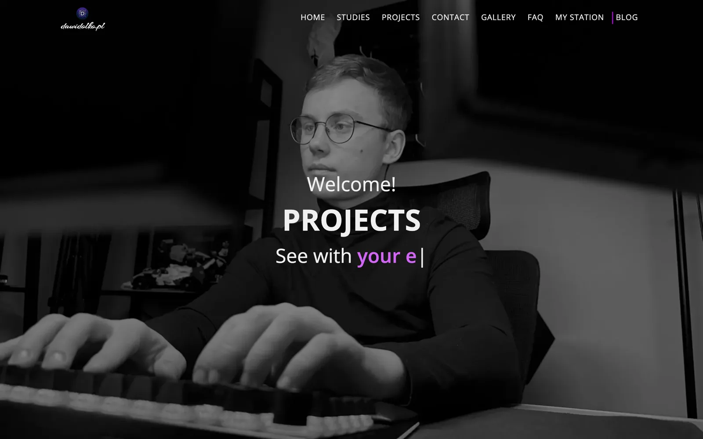

  

  

  
  
  
  
  
  

  
  
  

  

  

---

## 👋 About me

I am a full-stack developer from Rzeszów, Poland. I completed a **BEng in Computer Science** at the University of Rzeszów (2022–2026) and I am now working towards an **MSc** there. Since 2025 I have been building web applications at **Ideo Software**, and after hours I ship my own products — e-commerce storefronts, a banking platform on a real double-entry ledger, ticketing systems and machine learning classifiers.

Three things I care about in every project: functionality that actually works instead of a demo, documentation someone else can follow, and a deployment that keeps running once I walk away.

- 🏢 **Frontend Web Developer @ Ideo Software** — Laravel · PHP · React · MySQL
- 🎓 **MSc Computer Science** in progress · **BEng Computer Science** completed — University of Rzeszów
- 🧰 Comfortable across **four backend stacks** — Laravel, Django, ASP.NET Core and Nuxt/Node
- ♿ Every recent project ships with **accessibility work and bilingual (PL/EN) content**
- 🎬 Video creator on YouTube since 2023 — recording, editing and publishing my own channel
- 📫 Reach me at **dawid_olko@outlook.com**

### 📌 Portfolio at a glance

| Area | What is inside | Projects |
| --- | --- | :---: |
| 🎨 **Frontend** | React, Vue, Angular and Next.js storefronts, dashboards, landing pages and guides | 17 |
| 🚀 **Fullstack** | Laravel, Django, ASP.NET Core and Nuxt platforms with real databases | 13 |
| 🤖 **AI & ML** | Classifiers, ANFIS comparisons, PyTorch models and Streamlit dashboards | 5 |
| 💻 **Desktop** | JavaFX and Java Swing applications | 2 |
| 📱 **Mobile** | Kotlin / Android | 1 |

---

## 📄 CV

My CV lives as a page, in Polish and English, and prints to a single A4 sheet:
**[cv.dawidolko.pl](https://cv.dawidolko.pl)** · [English version](https://cv.dawidolko.pl/en/)

---

## 🚀 Featured Projects

<table markdown="1">
  <tr>
    <td width="50%" valign="top">
      <h3>SmartRecommender</h3>
      
Product recommendation platform combining collaborative and content-based filtering, association rules, fuzzy search, Bayesian analysis and sentiment analysis. Each method ships with its own UML documentation and admin debug views.

      

        
        
        
        
      

      
      
    </td>
    <td width="50%" valign="top">
      <h3>NeoBank</h3>
      
Fullstack banking platform built on a real double-entry ledger. Multi-currency accounts, transfers, standing orders, spending insights and an admin audit trail — with a verification script that reconciles eight ledger invariants straight from SQL.

      

        
        
        
      

      
    </td>
  </tr>
  <tr>
    <td width="50%" valign="top">
      <h3>IT Help Desk System</h3>
      
Enterprise ticketing platform with role-based access for users, technicians and administrators. Full ticket lifecycle, public and internal comments, live dashboard statistics and advanced sort, filter, search and pagination across every list.

      

        
        
        
        
      

      
    </td>
    <td width="50%" valign="top">
      <h3>MovieVault</h3>
      
Movie review platform inspired by IMDb and Filmweb. Browse and rate films, write reviews weighted differently for critics and users, manage a watchlist, and explore an admin dashboard with genre and rating analytics.

      

        
        
        
        
      

      
    </td>
  </tr>
  <tr>
    <td width="50%" valign="top">
      <h3>CinemaReserve</h3>
      
Cinema seat reservation system with an interactive colour-coded seat map, VIP sections, screening schedules and a full admin panel covering movies, halls, users, reservations and CMS-driven page content.

      

        
        
        
        
      

      
    </td>
    <td width="50%" valign="top">
      <h3>Machine Learning Studies</h3>
      
A set of end-to-end classification projects — airline passenger satisfaction with an MLP, wine quality model comparison, and cyber attack classification. Each documents its pipeline, guards against data leakage and reports results honestly.

      

        
        
        
        
      

      
      
    </td>
  </tr>
  <tr>
    <td width="50%" valign="top">
      <h3>ZbudujKompa</h3>
      
Bilingual PC building guide with an interactive configurator, compatibility checks, cooling and platform comparisons, and step-by-step assembly instructions. Built as a static export with a full accessibility panel and an automated test suite.

      

        
        
        
      

      
      
    </td>
      <td width="50%" valign="top">
        <h3>EzScout</h3>
        
Scouting reports and match analysis for football clubs and agents. Four packages with a stated number of matches watched, a sample report card in the hero and a FAQ built from &lt;details&gt; alone. Static export, no backend.

        

          
          
          
        

        
        
      </td>
  </tr>
  <tr>
      <td width="50%" valign="top">
        <h3>EzPace</h3>
        
Running coaching with a calculator that actually computes: distance and target time in, pace, speed and a split table out — including the leftover distance most calculators drop. Announced through aria-live as the inputs change.

        

          
          
          
        

        
        
      </td>
    <td width="50%" valign="top">
      <h3>BodyKit</h3>
      
Car tuning and body kit storefront with a filterable product catalog, cart, internationalised routing and a documented design system. Static export deployed to GitHub Pages with a dedicated accessibility checklist.

      

        
        
        
      

      
      
    </td>
  </tr>
</table>

  
<b>📂 All Projects — full catalogue</b>

|                                                            Logo                                                            | Project                                                                                                                 | Tech Stack                                                                                                                                                                                                                                                                                                                                                                           | Description                                                                                                                                                                                                                                                   |                                                                                                         ⭐ Stars                                                                                                         |
| :---: | --- | --- | --- | :---: |
|                                                                                                                            | **🎨 Frontend**                                                                                                         |                                                                                                                                                                                                                                                                                                                                                                                      |                                                                                                                                                                                                                                                               |                                                                                                                                                                                                                          |
|                              | [Portfolio](https://github.com/dawidolko/portfolio)                                                                     |                                                                                                                                                                                   | New personal portfolio website (2025-2026)                                                                                                                                                                                                                    |                                                                                                  |
|                                      | [dawidolko.pl](https://github.com/dawidolko/dawidolko.pl)                                                               |                                                                                            | Old personal portfolio website (2023-2024)                                                                                                                                                                                                                    |                                                                                            |
|                           | [WorkStation](https://github.com/dawidolko/WorkStation-Vue-TypeScript)                                                  |                                                                                                                                                                                | Professional workstation management interface                                                                                                                                                                                                                 |                                                                |
|                            | [FitnessGym](https://github.com/dawidolko/FitnessGym-Project-React)                                                     |                                                                                                                                                                                                                                                                                            | Fitness gym website with class schedules and memberships                                                                                                                                                                                                      |                                                                    |
|                          | [Layout-Simple-Vue](https://github.com/dawidolko/Layout-Simple-Vue)                                                     |                                                                                                                                                                                                                                                                                         | Minimalist layout template with Vue.js                                                                                                                                                                                                                        |                                                                                  |
|                                  | [Rent-App-Vue](https://github.com/dawidolko/Rent-App-Vue)                                                               |                                                                                                                                                                                                                                                                                         | Rental property browsing application                                                                                                                                                                                                                          |                                                                                            |
|                                 | [Kebab-Project](https://github.com/dawidolko/Kebab-Project-React)                                                       |                                                                                                                                                                                                                                                                                            | Restaurant menu and ordering interface                                                                                                                                                                                                                        |                                                                              |
|                            | [FrameVision](https://github.com/dawidolko/FrameVision-Project-HTML-CSS-JS-SASS)                                        |     | Responsive image gallery and visualization platform                                                                                                                                                                                                           |                                            |
|                              | [WidgetMart](https://github.com/dawidolko/WidgetMart-Project-HTML-CSS-JS)                                               |                                                                                            | Interactive widget marketplace interface                                                                                                                                                                                                                      |                                                        |
|                              | [CuriositiesMagazine](https://github.com/dawidolko/CuriositiesMagazine-Project-HTML-CSS)                                |                                                                                                                                                                                                     | Magazine-style content presentation website                                                                                                                                                                                                                   |                                            |
|                                     | [F1Zone](https://github.com/dawidolko/F1Zone-Project-HTML-CSS-JS-SASS)                                                  |     | Formula 1 fan website with race information and statistics                                                                                                                                                                                                    |                                                      |
|                         | [DevTechBlog](https://github.com/dawidolko/DevTechBlog-Platform-React)                                                  |                                                                                                                                                                                                                                                                                            | Developer tech blog platform for sharing articles and tutorials                                                                                                                                                                                               |                                                                |
|                             | [BitRecruit-Platform-NextJS](https://github.com/dawidolko/BitRecruit-Platform-NextJS)                                   |                                                                                                                                                                                            | BitRecruit recruitment platform built with Next.js                                                                                                                                                                                                            |                                                                |
|                               | [BodyKit-Shop-Frontend-NextJS](https://github.com/dawidolko/BodyKit-Shop-Frontend-NextJS)                               |     | Car tuning and body kit e-commerce storefront (static export)                                                                                                                                                                                                  |                                                            |
|                           | [ZbudujKompa](https://github.com/dawidolko/ZbudujKompa)                                                                 |     | Bilingual PC building guide: platforms, cooling, reference builds and step-by-step instructions                                                                                                                                                                |                                                                                        |
|                                                                                                                            | [EzScout-Platform-NextJS](https://github.com/dawidolko/EzScout-Platform-NextJS)                                         |    | Football scouting reports and match analysis for clubs and agents (static export)                                                                                                                              |                                                                          |
|                                                                                                                            | [EzPace-Platform-NextJS](https://github.com/dawidolko/EzPace-Platform-NextJS)                                           |    | Running coaching platform with a pace, speed and split-time calculator                                                                                                                                         |                                                                              |
|                                                                                                                            | **🚀 Fullstack**                                                                                                        |                                                                                                                                                                                                                                                                                                                                                                                      |                                                                                                                                                                                                                                                               |                                                                                                                                                                                                                          |
|                                | [SmartRecommender](https://github.com/dawidolko/SmartRecommender-Project-Django-React)                                  |                                                                                                                                                                                               | E-commerce recommendation system with collaborative filtering and sentiment analysis                                                                                                                                                                          |                                          |
|                            | [TechByte](https://github.com/dawidolko/TechByte-Project-Laravel)                                                       |                                                                                                                                                                                               | Technology news and blog platform                                                                                                                                                                                                                             |                                                                    |
|                                 | [ITHelpDeskSystem](https://github.com/dawidolko/ITHelpDeskSystem-Project-ASPNetCore-Vue)                                |                                                                                                                                                                                                  | IT helpdesk ticketing and support management system                                                                                                                                                                                                           |                                      |
|                  | [Weather-App](https://github.com/dawidolko/Weather-App-Laravel-React)                                                   |                                                                                                                                                                                            | Weather forecast application with API integration                                                                                                                                                                                                             |                                                                  |
|                                 | [LanguageCourses](https://github.com/dawidolko/LanguageCourses-Project-Laravel)                                         |                                                                                                                                                                                            | Language learning course management platform                                                                                                                                                                                                                  |                                                      |
|                            | [RentalVOD](https://github.com/dawidolko/RentalVOD-Project-Laravel)                                                     |                                                                                                                                                                                            | Video-on-demand rental service platform                                                                                                                                                                                                                       |                                                                  |
|                  | [Shop-App](https://github.com/dawidolko/Shop-App-Laravel-Vue)                                                           |                                                                                                                                                                                         | Full-featured e-commerce platform with SPA architecture                                                                                                                                                                                                       |                                                                            |
|                  | [Shop-Vue-Firestore](https://github.com/dawidolko/Shop-Vue-Firestore-Demo)                                              |                                                                                                                                                                                      | E-commerce demo application with real-time database                                                                                                                                                                                                           |                                                                      |
|                  | [Employees-List](https://github.com/dawidolko/Employees-List-Project-Laravel)                                           |                                                                                                                                                                                            | Employee management system with CRUD operations                                                                                                                                                                                                               |                                                        |
|                                | [CinemaReserve](https://github.com/dawidolko/CinemaReserve-Project-Node-Angular)                                        |                                                                                                                                                                                      | Cinema seat reservation system with booking management                                                                                                                                                                                                        |                                                |
|                                | [MovieVault](https://github.com/dawidolko/MovieVault-Project-SpringBoot-React)                                          |                                                                                                                                                                                   | Movie management and vault application                                                                                                                                                                                                                        |                                              |
|                                   | [MP-Industries](https://mp-industries.pl/)                                                                              |                                                                                                                                                                                            | Multibranch enterprise platform for CNC, LPG, dog breeding and honey products                                                                                                                                                                                 |                                                                                                                                      |
|           | [NeoBank-Platform-Nuxt](https://github.com/dawidolko/NeoBank-Platform-Nuxt)                                             |       | Fullstack banking platform: accounts, transfers, transaction history, auth and admin panel                                                                                                                                                                    |                                                                              |
|                                                                                                                            | **💻 Desktop**                                                                                                          |                                                                                                                                                                                                                                                                                                                                                                                      |                                                                                                                                                                                                                                                               |                                                                                                                                                                                                                          |
|                 | [TaskApp](https://github.com/dawidolko/TaskApp-JavaFX)                                                                  |                                                                                                                                                                                                                                                                                               | Desktop task management application with GUI                                                                                                                                                                                                                  |                                                                                        |
|                                | [ATM-System](https://github.com/dawidolko/ATM-System-Java-Swing)                                                        |                                                                                                                                                                                                                                                                                               | ATM banking simulation system                                                                                                                                                                                                                                 |                                                                          |
|                                                                                                                            | **📱 Mobile**                                                                                                           |                                                                                                                                                                                                                                                                                                                                                                                      |                                                                                                                                                                                                                                                               |                                                                                                                                                                                                                          |
|    | [WiFiDirectFileTransfer](https://github.com/dawidolko/WiFiDirectFileTransfer-Kotlin)                                    |                                                                                                                                                                                         | File transfer application using WiFi Direct technology                                                                                                                                                                                                        |                                                          |
|                                                                                                                            | **🤖 AI & ML**                                                                                                          |                                                                                                                                                                                                                                                                                                                                                                                      |                                                                                                                                                                                                                                                               |                                                                                                                                                                                                                          |
|                                 | [Comparison-ANFIS-Classical-ML](https://github.com/dawidolko/Comparison-ANFIS-Classical-Machine-Learning-Models-Python) |                                                                                                                                                                         | Comparative analysis of ANFIS and classical machine learning models                                                                                                                                                                                           |  |
|                                                                           | [DataFusion-App](https://github.com/dawidolko/DataFusion-App-Python)                                                    |                                                                                                                                                                         | Application for data fusion and computational analysis                                                                                                                                                                                                        |                                                                          |
|  | [CyberAttack-Classifier-Python](https://github.com/dawidolko/CyberAttack-Classifier-Python)                             |                                                                                                                                                                         | Python multiclass classifier for DDoS / Malware / Intrusion on Kaggle data (Random Forest, Gradient Boosting).                                                                                                                                                                                                                                                                                                                                             |                                                          |
|  | [WineQuality-Classifier-Python](https://github.com/dawidolko/WineQuality-Classifier-Python)                             |                                                                    | Multiclass wine quality classifier (Decision Tree / kNN / Random Forest × 3 + Majority Voting) with stratified 5-fold CV and a Streamlit app.                                                                                                                                                                                                                                                                                                              |                                                          |
|  | [Airline-Passenger-Classifier-Python-MLP-Classifier-Python](https://github.com/dawidolko/Airline-Passenger-Classifier-Python-MLP-Classifier-Python) |     | Multiclass airline passenger classifier (Class: Business / Eco / Eco Plus) — an MLP built from scratch in PyTorch vs Random Forest, with grid search and a Streamlit dashboard.                                                                                                                                                                                                                                                                            |                                                          |

  

<!-- 

I am a computer science student with a passion for technology, programming, and artificial intelligence. 🧠

I am always hungry for new knowledge and strive to explore the latest trends and tools that help me create innovative solutions. 💻

My passion for artificial intelligence goes beyond my studies - I aim to understand its various aspects and how it can be applied to solve real-world problems.

I believe that the future of technology lies in the hands of AI, and I am excited to be a part of that future.

On my GitHub, you will find various projects related to programming and artificial intelligence that showcase my growth and learning in these areas.

With each project, I aim to learn something new and enhance my skills.

Feel free to explore my projects and reach out to me if you have any questions or would like to discuss potential collaboration opportunities.

Thank you for visiting my profile. I'm glad you're here! 🎉

 -->

<!--
    Wiersze odlozone na pozniej (CMS, dawkit). Trzymamy je poza tabela:
    komentarz HTML postawiony w jej srodku przerywa parsowanie i cala
    tabela renderuje sie wtedy jako surowy tekst.

|                         | [dawkit-cms](https://github.com/dawidolko/dawkit)                                                                       |                                                                                                                                                                                            | My own CMS                                                                                                                                                                                                                                                    |                                                                                                        |
 |                                                                                                                          | **👺 CMS**                                                                                                              |                                                                                                                                                                                                                                                                                                                                                                                      |                                                                                                                                                                                                                                                               |                                                                                                                                                                                                                          |
-->

---

## 💼 Experience

| Period | Role | Company | Highlights |
| --- | --- | --- | --- |
| **03.2025 – Present** | Frontend Web Developer | Ideo Software · Rzeszów (hybrid) | Design and development of modern web applications, implementation of new features, testing and rollout of fixes, close collaboration with the project team on performance and security |
| **01.2025 – 03.2025** | PHP Web Developer (Internship) | Ideo Software · Rzeszów | Laravel + MySQL + React projects with API integration, working across frontend, backend and analyst teams |
| **10.2023 – Present** | Video Creator & Editor (Self-employed) | YouTube — "Dawid Olko" · Remote | End-to-end video production for my own channels: concept, recording, editing and publishing — gameplay, vlogs and technology content |

**Ideo Software** — 1 year 8 months total · Rzeszów, Podkarpackie, Poland · Hybrid
Skills: Laravel · PHP · React · Git/GitHub · MySQL

---

## 🖼️ Screenshots

You can take a look at the UI on some of my side projects below.

  
  
  
  
  

  
  
  
  
  

---

## 🧰 Tech Stack

<table>
  <tr>
    <td align="right" width="140"><b>Languages</b></td>
    <td></td>
  </tr>
  <tr>
    <td align="right"><b>Frontend</b></td>
    <td></td>
  </tr>
  <tr>
    <td align="right"><b>Backend</b></td>
    <td></td>
  </tr>
  <tr>
    <td align="right"><b>Databases</b></td>
    <td></td>
  </tr>
  <tr>
    <td align="right"><b>DevOps &amp; Tools</b></td>
    <td></td>
  </tr>
  <tr>
    <td align="right"><b>ML &amp; Data</b></td>
    <td></td>
  </tr>
</table>

  

---

## 📊 GitHub Analytics

  
  

  

  
  
  

  

---

## 🤝 Connect with me

  
  
  
  
  
  
  
  

  

  

  

  <b>⭐ If any of this is useful, a star on the repository means a lot.</b>

