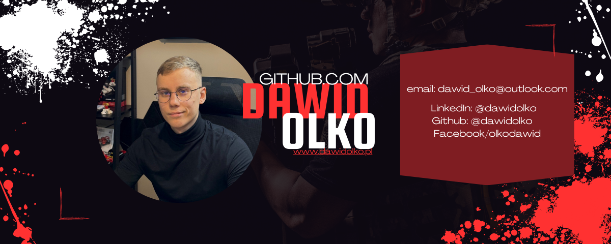

 
  

  <h1>
    
  </h1>

  

  

  

I am a computer science student with a passion for technology, programming, and artificial intelligence. 🧠

I am always hungry for new knowledge and strive to explore the latest trends and tools that help me create innovative solutions. 💻

My passion for artificial intelligence goes beyond my studies - I aim to understand its various aspects and how it can be applied to solve real-world problems.

I believe that the future of technology lies in the hands of AI, and I am excited to be a part of that future.

On my GitHub, you will find various projects related to programming and artificial intelligence that showcase my growth and learning in these areas.

With each project, I aim to learn something new and enhance my skills.

Feel free to explore my projects and reach out to me if you have any questions or would like to discuss potential collaboration opportunities.

Thank you for visiting my profile. I'm glad you're here! 🎉

  

## **My profile stats here:**

  

  
  

  

  

## **Skills & Technologies:**

  Visitors : 
  

  

    
  

  

    
  

  

    
  

  

    
  

  

  

## **Connect with me:**

  

  

    
  

    
    

  

  

    
    
    
    
    
  

  

  

  

  

